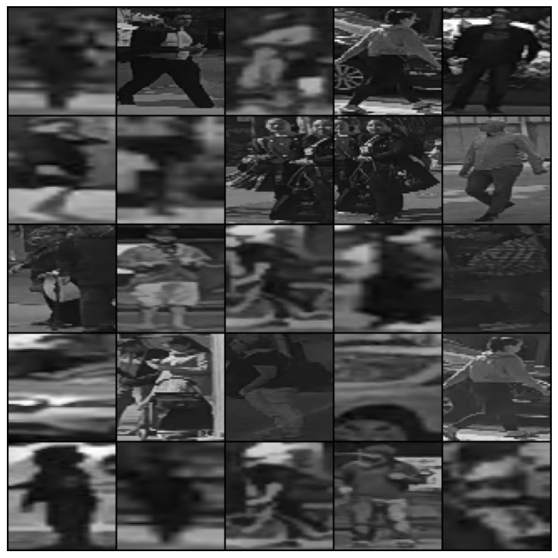

# Pedestrian classification

## Authors
 - [Erik Matovič](https://github.com/Matovic)
 - Jakub Horvat 

## Solution
### 1. Data Transformation
[Dataset](https://data.nvision2.eecs.yorku.ca/PIE_dataset/)

[Final transformed data](https://stubask-my.sharepoint.com/:u:/g/personal/xmatovice_stuba_sk/EbJaQifX48pEg9o0ZDGJ-ewB79fffZ8ATrQ1ylEZh3EbsQ?e=HlRs85):
 <p align="center">
	
</p>

### 2. Exploratory Data Analysis

Pairplot:
 <p align="center">
	
</p>

Heatmap:
 <p align="center">
	
</p>

Target variable price_range based on values of ram:
 <p align="center">
	
</p>


### 3. Data Preprocessing

Based on [exploratory data analysis](./src/EDA.ipynb) test set does not have target variable price_range. We split our dataset into train-dev-test. We have train and test sets, but we split test set by half to dev-test sets. We will rougly have train-dev-test 80%-10%-10%.  


### 3. Model
Best parameters from WandB:
 - batch size: 512,
 - hidden size: 256,
 - epochs: 100,
 - learning rate: 0.03648030109469176

```python3
class MLP(nn.Module):
    """ 
    Model class.
    :param Module from torch.nn
    """
    def __init__(self, n_inputs: int, n_classes: int, lr: float, hidden_size: float) -> None:
        """
        Model elements init.
        """
        super(MLP, self).__init__()
        self.n_inputs = n_inputs
        self.n_classes = n_classes
        self.lr = lr
        self.hidden_size = hidden_size
    
        self.dense1 = nn.Linear(n_inputs, self.hidden_size)
        self.dense2 = nn.Linear(self.hidden_size, self.hidden_size)
        self.dense3 = nn.Linear(self.hidden_size, self.hidden_size)
        self.dense4 = nn.Linear(self.hidden_size, self.hidden_size)
        self.dense5 = nn.Linear(self.hidden_size, self.hidden_size)
        self.dense6 = nn.Linear(self.hidden_size, self.n_classes)
        self.relu = nn.ReLU()
        self.droput = nn.Dropout(p=0.05)
 
    def forward(self, X:torch.Tensor) -> torch.Tensor:
        """
        Feed forward
        """
        # input to first hidden layer
        output = self.dense1(X)
        output = self.relu(output)
        output = self.droput(output)
        
        output = self.dense2(output)
        output = self.relu(output)
        output = self.droput(output)

        output = self.dense3(output)
        output = self.relu(output)
        output = self.droput(output)
        
        output = self.dense4(output)
        output = self.relu(output)
        output = self.droput(output)
        
        output = self.dense5(output)
        output = self.relu(output)
        output = self.droput(output)

        # final layer and output
        output = self.dense6(output)

        return output
```

### 4. Training & validation

```python3
def accuracy_fn(y_true, y_pred):
    correct = torch.eq(y_true, y_pred).sum().item() 
    return correct


def train_mlp(n_epochs, mlp, optimizer, loss_fn, 
              train_dl, val_dl, device, batch_size):
    # init train lists for statistics
    loss_train, accuracy_train = list(), list()

    # init validation lists for statistics
    loss_validation, accuracy_validation = list(), list()

    # enumerate epochs
    for epoch in range(n_epochs):
        # init epoch train counters
        epoch_train_accuracy, epoch_train_total, epoch_train_true, epoch_train_loss = 0, 0, 0, 0

        # init epoch validation counters
        epoch_validation_accuracy, epoch_validation_total, \
            epoch_validation_true, epoch_validation_loss = 0, 0, 0, 0

        # enumerate mini batches
        for idx, (X_batch, y_batch) in enumerate(train_dl):
            X_batch, y_batch = X_batch.to(device), y_batch.to(device)
            # clear the gradients
            optimizer.zero_grad()
            # Make prediction logits with model
            y_logits = mlp(X_batch)
            y_pred_probs = torch.softmax(y_logits, dim=1) 
            # go from logits -> prediction probabilities -> prediction labels
            y_pred = torch.argmax(y_pred_probs, dim=1) 
            
            loss = loss_fn(y_logits, y_batch)
            loss.backward()
            # update model weights
            optimizer.step()

            # update train counters
            epoch_train_loss += loss.item()
            epoch_train_true += accuracy_fn(y_batch, y_pred)
            epoch_train_total += len(y_batch)
        
        # update train accuracy & loss statistics
        epoch_train_accuracy = (epoch_train_true/epoch_train_total) * 100
        epoch_train_loss /= (len(train_dl.dataset)/train_dl.batch_size)

        # disable gradient calculation
        with torch.no_grad():
            for idx, (X_batch, y_batch) in enumerate(val_dl):
                X_batch, y_batch = X_batch.to(device), y_batch.to(device)
                # compute the models output
                test_logits = mlp(X_batch)
                test_pred = torch.softmax(test_logits, dim=1).argmax(dim=1)
                # calculate loss
                loss = loss_fn(test_logits, y_batch)

                # update validation counters
                epoch_validation_loss += loss.item()
                epoch_validation_true += accuracy_fn(y_batch, test_pred)
                epoch_validation_total += len(y_batch)
        
        # update validation accuracy & loss statistics
        epoch_validation_accuracy = (epoch_validation_true/epoch_validation_total) * 100
        epoch_validation_loss /= (len(val_dl.dataset)/val_dl.batch_size)

        # update global epochs statistics
        loss_train.append(epoch_train_loss)
        accuracy_train.append(epoch_train_accuracy)
        loss_validation.append(epoch_validation_loss)
        accuracy_validation.append(epoch_validation_accuracy)

        if epoch == (n_epochs - 1): 
            print(
                f'Epoch {epoch}/{n_epochs}: \
                train loss {loss_train[-1]}, \
                validation loss {loss_validation[-1]}, \
                train accuracy {accuracy_train[-1]}, \
                validation accuracy {accuracy_validation[-1]}'
            )

    return loss_train, accuracy_train, loss_validation, accuracy_validation
```

<p align="center">
	
</p>

Loss accuracy vs validation accuracy from the exercise 6:
<p align="center">
	
</p>


### 5. Testing

```python3
def evaluation(mlp, test_dl):
    y_pred_all, y_test_all = list(), list()

	# evaluate on test set
    with torch.no_grad():
        for X_batch, y_batch in test_dl:
            X_batch, y_batch = X_batch.to(device), y_batch.to(device)
            y_hat = mlp(X_batch)
            test_pred = torch.softmax(y_hat, dim=1).argmax(dim=1)
            epoch_validation_true += accuracy_fn(y_batch, test_pred)
            
            y_pred_all.extend(test_pred.cpu().numpy())
            y_test_all.extend(y_batch.cpu().numpy())
        epoch_validation_true = (epoch_validation_true / len(test_dl.dataset)) * 100

    print('acc:', epoch_validation_true)
    report = classification_report(y_test_all, y_pred_all, target_names=['0', '1', '2', '3'], digits=4)
    print(report)
```

<p align="center">
	
</p>

<p align="center">
	
</p>

### 6. Classification
Classification on unknown data.  
```python3
matrix = confusion_matrix(y_test_all, y_pred_all)
matrix_display = ConfusionMatrixDisplay(matrix, display_labels=['0', '1', '2', '3'])
matrix_display.plot(cmap='Blues')
```

<p align="center">
	
</p>

## Conclusion
Training was on the GPU using CUDA. 

