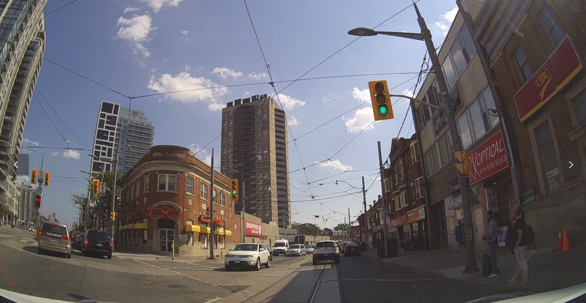
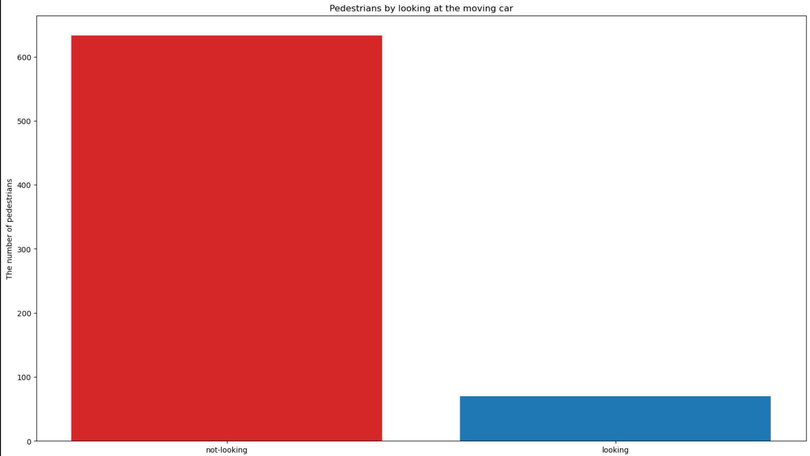
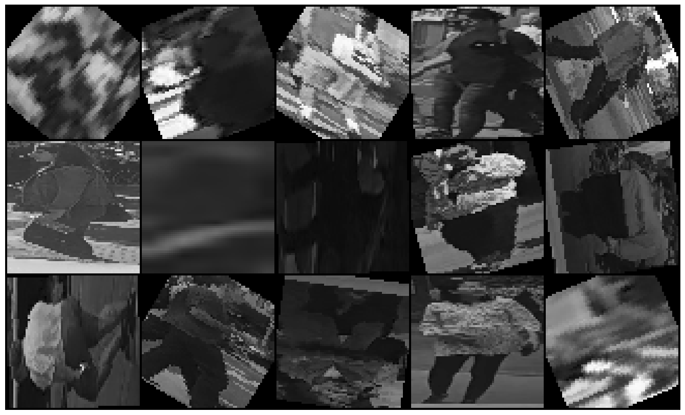

# Pedestrian classification

## Authors
 - [Erik Matovič](https://github.com/Matovic)
 - Jakub Horvat 

## Solution
We use the PIE class from [pie_data Python file](./src/pie_data.py) to make our train, validation and test dataset. Python file pie_data is available with XML annotations to extract labels.

### 1. Exploratory Data Analysis & Data Transformations
Frame from the [PIE dataset videos](https://data.nvision2.eecs.yorku.ca/PIE_dataset/):
 <p align="center">
	
</p>

To extract and save only annotated frames(roughly 1TB) from video sets, we use the PIE object method:

```python3
def extract_img(pie: PIE) -> None:
    """
    Extract and save only annotated frames.
    :param: pie: PIE object
    """
    pie.extract_and_save_images(extract_frame_type='annotated')
```

We make three instances of our defined class to extract only annotated pedestrians. Training, validation, and test sets contain 139 404 frames, 43 885 frames and 109 641 frames, respectively.

```python3
class PIE_peds():
    def __init__(self, setname: str, pie: PIE) -> None:
        #super().__init__()
        self.setname = setname
        self.set_dir = dict()
        self.all_path = list()
        self.all_filenames = list()
        self.path = pie._images_path

        assert setname in ['train', 'val', 'test']
        
        self.img_init(pie)
        
    
    def __len__(self):
        return len(self.all_filenames)
    
    def img_init(self, pie) -> None:
        set_list = pie._get_image_set_ids(self.setname)

        for set_ in set_list:
            set_path = join(pie._images_path, set_)
            self.set_dir[set_] = dict()
            
            set_content = listdir(set_path)
            for video in set_content:
                video_path = join(set_path, video)
                imgs = listdir(video_path)
                self.all_path += ([video_path] * len(imgs))
                self.all_filenames += imgs
                self.set_dir[set_][video] = imgs
        print(self.set_dir)    
```

Next, we make our image dataset with CSV annotations. It is also necessary to encode gender and crossing values for our architecture. For females, it is 0, and for irrelevant crossing, it is 2. 

```python3
def save_img_annotations(dataset: PIE_peds, folder: str) -> None:
    """
    Save images into given folder and also CSV annotations. 

    :param dataset: PIE_peds class, where all paths are set. 
    :param folder: folder train or val or test to save pedestrians.
    """
    assert folder in ['train', 'val', 'test']

    target = dict()
    target['set'] = []
    target['video'] = []
    target['frame'] = []
    target['ped_idx'] = []
    target['ped'] = []
    target['BBox'] = []
    target['action'] = []
    target['age'] = []
    target['gender'] = []
    target['look'] = []
    target['cross'] = []

    for set_name in dataset.set_dir:
        for video in dataset.set_dir[set_name]:
            annotations = pie._get_annotations(set_name, video)
            annotations_attributes = pie._get_ped_attributes(set_name, video)
            for frame in dataset.set_dir[set_name][video]: 
                img_path = '../images/' + set_name + '/' + video + '/' + frame
                video + '/' + frame

                img = cv2.imread(img_path)
                for idx in annotations['ped_annotations']:
                    frame_idx = int(frame[:-4])
                    # get only annotated frames with pedestrians
                    if frame_idx in annotations['ped_annotations'][idx]['frames']:
                        # skip existing pedestrian
                        if idx in target['ped']:
                            break

                        frame_key = annotations['ped_annotations'][idx]['frames'].index(frame_idx)
                        
                        # set annotations in dictionary
                        target['set'].append(set_name)
                        target['video'].append(video)
                        target['frame'].append(frame)
                        target['ped_idx'].append(frame_key)
                        target['ped'].append(idx)
                        target['BBox'].append(annotations['ped_annotations'][idx]['bbox'][frame_key])
                        target['action'].append(annotations['ped_annotations'][idx]['behavior']['action'][frame_key])
                        target['age'].append(annotations_attributes[idx]['age'])
                        target['gender'].append(annotations_attributes[idx]['gender'])
                        target['look'].append(annotations['ped_annotations'][idx]['behavior']['look'][frame_key])
                        target['cross'].append(annotations['ped_annotations'][idx]['behavior']['cross'][frame_key])
                        
                        # BBox for pedestrian
                        x1 = floor(target['BBox'][-1][0])
                        y1 = floor(target['BBox'][-1][1])
                        x2 = ceil(target['BBox'][-1][2])
                        y2 = ceil(target['BBox'][-1][3])

                        # crop pedestrian and make grayscale
                        crop_img = img[y1:y2, x1:x2]
                        crop_img = cv2.cvtColor(crop_img, cv2.COLOR_BGR2GRAY)
                        crop_img = cv2.resize(crop_img, (64, 64))
                        
                        # save image
                        f_name = '../images/' + folder + '/' + set_name + '_' + video + '_' + target['ped'][-1] + '_' + frame
                        cv2.imwrite(f_name, crop_img)

    # save annotations as CSV file                    
    df = pd.DataFrame(data=target)
    annotations_path = '../' + folder + '_annotations.csv'
    df.to_csv(annotations_path)
```

Exploratory data analysis shows the imbalanced dataset. As a result, we cloned training and validation images with low crossing and looking values and augmented cloned frames by rotating them. We also append our annotations with augmented clones. Furthermore, we build our architecture without the age class because age values are the most imbalanced.
<p align="center">
	
	
	
	
	
</p>

```python3
df = pd.DataFrame() # we append our annotations with augmented clones

root_path = '../images/train/'  # <root path for train or val>
for file in imgs_names:
    img_path = root_path + file
    img = Image.open(Path(img_path))

    # for train, for val it is 14 and 36
    set_idx_start = 16
    ped_index_start = 38

    # pedestrian index is varying
    ped_index = img_path.index('_', ped_index_start)

    set_name = img_path[set_idx_start:set_idx_start+5]
    video_name = img_path[set_idx_start+6:set_idx_start+16]
    ped_name = img_path[set_idx_start+17:ped_index]
    frame_name = img_path[ped_index + 1:ped_index + 10]

    for i in range(10):
        degree = int((torch.rand(1) * 360) % 360)
        rotated_img = transforms.RandomRotation(degrees=degree)(img)
        # save a image using extension
        fname = img_path + f'_rotated_{i}.png'

        # df_clones is a pandas dataframe containg cross values to be cloned
        # later it contains look values to be cloned 
        label = df_clones.loc[
            (df_clones.set == set_name) &
            (df_clones.video == video_name) &
            (df_clones.frame == frame_name) &
            (df_clones.ped == ped_name), :
        ]
        
        df2 = label.loc[label.frame == frame_name, :]
        df2['frame'] = frame_name + f'_rotated_{i}.png'
        df = pd.concat([df, df2])
        rotated_img = rotated_img.save(fname)
```
Initially, the training dataset contains 703 different pedestrians. We then have 1993 training images by cloning and rotating clones.
 <p align="center">
	
	
	
	
</p>

Final transformed data can be downloaded from [here](https://stubask-my.sharepoint.com/:u:/g/personal/xmatovice_stuba_sk/EbJaQifX48pEg9o0ZDGJ-ewB79fffZ8ATrQ1ylEZh3EbsQ?e=HlRs85):
 <p align="center">
	
</p>

### 2. Data Preprocessing

Based on [exploratory data analysis](./src/EDA.ipynb) test set does not have target variable price_range. We split our dataset into train-dev-test. We have train and test sets, but we split test set by half to dev-test sets. We will rougly have train-dev-test 80%-10%-10%.  

```python3
class PIE_dataset(Dataset):
    """
    Dataset class for dataloader.
    """
    def __init__(self, setname: str, pie: PIE) -> None:
        """
        Dataset init.
        :param setname: specifying trainig, validation or test set
        """
        assert setname in ['train', 'val', 'test'], 'wrong setname, accepting only \'train\', \'val\', \'test\''
        
        super().__init__()
        self.setname = setname
        self.img_path = pie._images_path + '/' + self.setname + '/'
        self.annotations_path = '../' + self.setname + '_annotations.csv'
        self.all_filenames = listdir(self.img_path)
        self.all_annotations = pd.read_csv(self.annotations_path)     
        self.all_annotations_meaning = self.all_annotations.columns.values.tolist()

        # Setting labels
        self.label_action = self.all_annotations['action']
        self.label_gender = self.all_annotations['gender']
        self.label_look = self.all_annotations['look']
        self.label_cross = self.all_annotations['cross']   
        
    
    def __len__(self) -> int:
        """
        Return the total number of images.
        returns: The total number of images.
        """
        return len(self.all_filenames)
    

    def __getitem__(self, index) -> dict:
        """
        Get item with annotations.
        :param index: the number of image
        returns: Dictionary.
        """
        file_name = self.all_filenames[index]
        img_path = self.img_path + file_name
        
        # Read the input image
        img = Image.open(img_path)#.convert('RGB')
        # convert image to torch tensor
        img_tensor = transforms.ToTensor()(img)
        # transform to normalize the image with mean and std
        transform = transforms.Normalize(mean=(0.2,), std=(0.2,))
        normalized_img_tensor = transform(img_tensor)

        # train
        set_idx_start = 16
        ped_index_start = 38
        
        # val
        if self.setname == 'val':
            set_idx_start = 14
            ped_index_start = 36

        # test
        if self.setname == 'test':
            set_idx_start = 15
            ped_index_start = 37

        # pedestrian index is varying from index 38 to 41
        ped_index = img_path.index('_', ped_index_start)

        set_name = img_path[set_idx_start:set_idx_start+5]
        video_name = img_path[set_idx_start+6:set_idx_start+16]
        ped_name = img_path[set_idx_start+17:ped_index]
        frame_name = img_path[ped_index + 1:]
        
        label = self.all_annotations.loc[
            (self.all_annotations.set == set_name) &
            (self.all_annotations.video == video_name) &
            (self.all_annotations.frame == frame_name) &
            (self.all_annotations.ped == ped_name)
        ]

        label_action = torch.tensor(self.label_action[label.index[0]], dtype=torch.float)
        label_gender = torch.tensor(self.label_gender[label.index[0]], dtype=torch.float)
        label_look = torch.tensor(self.label_look[label.index[0]], dtype=torch.float)
        label_cross = torch.tensor(self.label_cross[label.index[0]], dtype=torch.long)
        
        return {'data': normalized_img_tensor,
                'label_action': label_action,
                'label_gender': label_gender,
                'label_look': label_look,
                'label_cross': label_cross,
                'img_idx': index}
```

### 3. Model
Best parameters from WandB:
 - batch size: 32,
 - hidden size: 256,
 - epochs: 50,
 - learning rate: 0.05657808132757078
 - momentum: 0.7500727372948774

```python3
class MLP(nn.Module):
    """ 
    Model class.
    :param Module from torch.nn
    """
    def __init__(self, n_inputs: int, n_classes: int, lr: float, hidden_size: float) -> None:
        """
        Model elements init.
        """
        super(MLP, self).__init__()
        self.n_inputs = n_inputs
        self.n_classes = n_classes
        self.lr = lr
        self.hidden_size = hidden_size
    
        self.dense1 = nn.Linear(n_inputs, self.hidden_size)
        self.dense2 = nn.Linear(self.hidden_size, self.hidden_size)
        self.dense3 = nn.Linear(self.hidden_size, self.hidden_size)
        self.dense4 = nn.Linear(self.hidden_size, self.hidden_size)
        self.dense5 = nn.Linear(self.hidden_size, self.hidden_size)
        self.dense6 = nn.Linear(self.hidden_size, self.n_classes)
        self.relu = nn.ReLU()
        self.droput = nn.Dropout(p=0.05)
 
    def forward(self, X:torch.Tensor) -> torch.Tensor:
        """
        Feed forward
        """
        # input to first hidden layer
        output = self.dense1(X)
        output = self.relu(output)
        output = self.droput(output)
        
        output = self.dense2(output)
        output = self.relu(output)
        output = self.droput(output)

        output = self.dense3(output)
        output = self.relu(output)
        output = self.droput(output)
        
        output = self.dense4(output)
        output = self.relu(output)
        output = self.droput(output)
        
        output = self.dense5(output)
        output = self.relu(output)
        output = self.droput(output)

        # final layer and output
        output = self.dense6(output)

        return output
```

### 4. Training & validation

```python3
def accuracy_fn(y_true, y_pred):
    correct = torch.eq(y_true, y_pred).sum().item() 
    return correct


def train_mlp(n_epochs, mlp, optimizer, loss_fn, 
              train_dl, val_dl, device, batch_size):
    # init train lists for statistics
    loss_train, accuracy_train = list(), list()

    # init validation lists for statistics
    loss_validation, accuracy_validation = list(), list()

    # enumerate epochs
    for epoch in range(n_epochs):
        # init epoch train counters
        epoch_train_accuracy, epoch_train_total, epoch_train_true, epoch_train_loss = 0, 0, 0, 0

        # init epoch validation counters
        epoch_validation_accuracy, epoch_validation_total, \
            epoch_validation_true, epoch_validation_loss = 0, 0, 0, 0

        # enumerate mini batches
        for idx, (X_batch, y_batch) in enumerate(train_dl):
            X_batch, y_batch = X_batch.to(device), y_batch.to(device)
            # clear the gradients
            optimizer.zero_grad()
            # Make prediction logits with model
            y_logits = mlp(X_batch)
            y_pred_probs = torch.softmax(y_logits, dim=1) 
            # go from logits -> prediction probabilities -> prediction labels
            y_pred = torch.argmax(y_pred_probs, dim=1) 
            
            loss = loss_fn(y_logits, y_batch)
            loss.backward()
            # update model weights
            optimizer.step()

            # update train counters
            epoch_train_loss += loss.item()
            epoch_train_true += accuracy_fn(y_batch, y_pred)
            epoch_train_total += len(y_batch)
        
        # update train accuracy & loss statistics
        epoch_train_accuracy = (epoch_train_true/epoch_train_total) * 100
        epoch_train_loss /= (len(train_dl.dataset)/train_dl.batch_size)

        # disable gradient calculation
        with torch.no_grad():
            for idx, (X_batch, y_batch) in enumerate(val_dl):
                X_batch, y_batch = X_batch.to(device), y_batch.to(device)
                # compute the models output
                test_logits = mlp(X_batch)
                test_pred = torch.softmax(test_logits, dim=1).argmax(dim=1)
                # calculate loss
                loss = loss_fn(test_logits, y_batch)

                # update validation counters
                epoch_validation_loss += loss.item()
                epoch_validation_true += accuracy_fn(y_batch, test_pred)
                epoch_validation_total += len(y_batch)
        
        # update validation accuracy & loss statistics
        epoch_validation_accuracy = (epoch_validation_true/epoch_validation_total) * 100
        epoch_validation_loss /= (len(val_dl.dataset)/val_dl.batch_size)

        # update global epochs statistics
        loss_train.append(epoch_train_loss)
        accuracy_train.append(epoch_train_accuracy)
        loss_validation.append(epoch_validation_loss)
        accuracy_validation.append(epoch_validation_accuracy)

        if epoch == (n_epochs - 1): 
            print(
                f'Epoch {epoch}/{n_epochs}: \
                train loss {loss_train[-1]}, \
                validation loss {loss_validation[-1]}, \
                train accuracy {accuracy_train[-1]}, \
                validation accuracy {accuracy_validation[-1]}'
            )

    return loss_train, accuracy_train, loss_validation, accuracy_validation
```

<p align="center">
	
</p>

Loss accuracy vs validation accuracy from the exercise 6:
<p align="center">
	
</p>


### 5. Testing

```python3
def evaluation(mlp, test_dl):
    y_pred_all, y_test_all = list(), list()

	# evaluate on test set
    with torch.no_grad():
        for X_batch, y_batch in test_dl:
            X_batch, y_batch = X_batch.to(device), y_batch.to(device)
            y_hat = mlp(X_batch)
            test_pred = torch.softmax(y_hat, dim=1).argmax(dim=1)
            epoch_validation_true += accuracy_fn(y_batch, test_pred)
            
            y_pred_all.extend(test_pred.cpu().numpy())
            y_test_all.extend(y_batch.cpu().numpy())
        epoch_validation_true = (epoch_validation_true / len(test_dl.dataset)) * 100

    print('acc:', epoch_validation_true)
    report = classification_report(y_test_all, y_pred_all, target_names=['0', '1', '2', '3'], digits=4)
    print(report)
```

<p align="center">
	
</p>

<p align="center">
	
</p>

### 6. Classification
Classification on unknown data.  
```python3
matrix = confusion_matrix(y_test_all, y_pred_all)
matrix_display = ConfusionMatrixDisplay(matrix, display_labels=['0', '1', '2', '3'])
matrix_display.plot(cmap='Blues')
```

<p align="center">
	
</p>

## Conclusion
Training was on the GPU using CUDA. 

